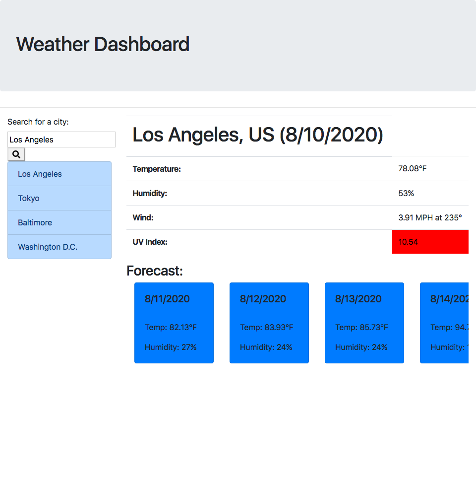

# weather_app_html

A simple web app that allows the user to find out the weather in different cities around the world using APIs from [OpenWeatherMap](https://openweathermap.org/api)

Saves a list of places that are able to be clicked on to retreive weather data.

[Link to Deployed Version](https://chrisfaux95.github.io/weather_app_html/)